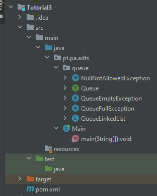

**Objetivos:**

-   Especificação e implementação de ADTs na linguagem Java;
-   Desenvolvimento de testes unitários;
-   Simulação de desenvolvimento de código usando TDD – *Test Driven Development*;
-   Simulação de desenvolvimento cooperativo entre equipas.

**NOTA**: Este tutorial requer o trabalho simultâneo e autónomo de dois grupos **A** e **B** (ou dois elementos do mesmo grupo, cada um deles a trabalhar autonomamente).

***

Cada um dos grupos irá desenvolver apenas uma parte do código do projeto e fornecerá a sua parte ao outro grupo que a deverá integrar no projeto sem que apareçam erros de compilação ou execução. Caso tal suceda, os grupos em conjunto, deverão analisar as razões pelas quais tal sucedeu e corrigir a situação.

**Test Driven Development (TDD)** *is a software development practice that focuses on creating unit test cases before developing the actual code [* [*fonte*](https://www.browserstack.com/guide/what-is-test-driven-development#:~:text=In%20layman's%20terms%2C%20Test%20Driven,unit%20test%20creation%2C%20and%20refactoring.) *].*

# Introdução

Execute o IntelliJ e clone o projeto que se encontra disponível no seguinte endereço:

<https://github.com/estsetubal-pa-2023-24/Tutorial3Template>

As operações que deverão ser suportadas sobre uma *queue* `Q` são apresentadas em seguida:

-   Operações principais:
    -   **enqueue(**`e`**)** - insere o elemento `e` no final de `Q`; a operação deve resultar em **erro** se não existir capacidade/memória para mais elementos;

***

-   **dequeue()** - remove e devolve o elemento que se encontra atualmente no início de `Q`; a operação deve resultar em **erro** se `Q` estiver vazia;

***

-   **front()** - devolve, sem remover, o elemento que se encontra atualmente no início de `Q`; a operação deve resultar em **erro** se `Q` estiver vazia.

***

-   Operações genéricas sobre coleções:
    -   **size()** - devolve o número de elementos atualmente em `Q`;

***

-   **isEmpty()** - devolve um valor lógico que indica se `Q` está vazia, ou não;

***

-   **clear()** - descarta todos os elementos presentes em `Q` voltando esta ao estado *vazia*.

***

# Parte 1 – Grupo A e Grupo B [em conjunto]

1.  O projeto que acabou de clonar deverá apesentar uma estrutura semelhante à da imagem seguinte.
1.  Observe a interface **Queue\<T\>** que descreve o comportamento (o “contrato”) de uma fila na linguagem Java, de acordo com a especificação fornecida, que armazena elementos de um tipo **T** genérico;
    1.  Dê particular atenção à documentação desta interface em formato **Javadoc**;
    2.  Altere a classe **QueueLinkedList** de tal forma que esta tenha de implementar os métodos indicados na *interface* **Queue\<T\>**. Gere o código “vazio” que permite que deixe de haver erros no projeto;
    3.  Escreva o código das classes que tratam as exceções **NullNotAllowedException** e **QueueEmptyException**. Cada uma delas deve permitir dois construtores – um sem parâmetros e o outro com um parâmetro com mensagem do erro associada à exceção.

**  
**

# Parte 2 - Grupo A: Implementação de ADT

Implementação da **QueueLinkedList**.

Forneça uma implementação de **Queue\<T\>** baseada numa lista ligada, na classe **QueueLinkedList**, usando a abordagem da Figura 1.

NOTA: Esta implementação do ADT *Queue* é baseada em *linked list* e possíveis abordagens com respetivas complexidades para as operações principais, com inserção (*enqueue*) no final da lista e remoção (*dequeue*) do início da lista. Trata-se de uma lista duplamente ligada com dupla sentinela.

Adicione os comentários **Javadoc** à classe, detalhando a sua implementação e complexidades algorítmicas das operações, ao construtor da classe, aos seus atributos e classe interna.

# Parte 3 - Grupo B: *Unit Testing*

Pretende-se, objetivamente, testar implementações de *Queue*. Deverá desenvolver um conjunto de testes unitários para verificar a correta implementação dos métodos da classe **QueueLinkedList**, mesmo sabendo que esta ainda não foi implementada. Como sabemos o que cada método tem de fazer, podemos escrever antecipadamente os testes que o futuro código da classe terá de passar com distinção.

>   Utilize instância(s) de `QueueLinkedList<Integer>` no desenvolvimento dos seguintes testes:

O princípio **FIFO** é garantido na invocação dos métodos **enqueue**, **dequeue** e **front**;

As exceções são corretamente lançadas nos métodos **dequeue** e **front**, nas condições previstas;

O método **size**() devolve valores corretos à medida que são adicionados e removidos elementos;

O método **size**() devolve valores corretos após invocação do método **clear**() (existindo ou não elementos na fila);

O método **isEmpty**() devolve valores corretos à medida que são adicionados e removidos elementos;

O método **isEmpty**() devolve valores corretos após invocação do método **clear**() (existindo ou não elementos na fila).

# Parte 4 – Grupos A e B: Junção ADT + JUnit

Verificação da implementação do ADT com os testes unitários.

O **grupo A** deverá fornecer o código da implementação do ADT **QueueLinkedList** ao grupo B;

O **grupo B** deverá fornecer – ao **grupo A** – o conjunto de testes que implementou;

Devem verificar se o código dos testes valida corretamente a implementação do ADT e, caso tal não aconteça, deverão procurar **em conjunto** a solução para as incorreções.

# Parte 5 – Trabalho complementar (Implementação de novo ADT e Unit Testing)

Implementação e teste da classe **QueueLinkedListNoNulls**.

Implemente a classe **QueueLinkedListNoNulls**. É uma classe derivada da classe implementada no Nível 2. Esta implementação garante que não é possível adicionar elementos **null** à fila. Se for o caso, deverá ser lançada a exceção denominada **NullNotAllowedException** já implementada no ponto 1.

Crie um conjunto um teste unitário que permita verificar o lançamento da exceção aquando da tentativa de inserção de um elemento a `null`.

***

Crie um novo conjunto de testes unitários para esta classe, incluindo todos os existentes em `QueueLinkedListTest`.

***

Crie uma instância da classe no método `main` para ilustrar a correção da sua implementação.

***
