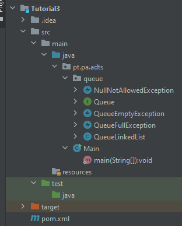
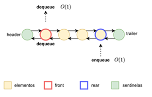

# Programação Avançada | Lab2

🇬🇧 [Versão em Português](README.md)

**Goals:**

- Specification and implementation of ADTs in the Java language;
- Development of unit tests;
- Code development simulation using TDD – Test Driven Development;
- Simulation of cooperative development between teams.

**NOTE**: This tutorial requires the simultaneous and autonomous work of two groups A and B (or two members of the same group, each working autonomously).

Each group will develop only a part of the project's code and will provide its part to the other group, which must integrate it into the project without any compilation or execution errors appearing. If this happens, the groups together must analyze the reasons why this happened and correct the situation.

**Test Driven Development (TDD)** *is a software development practice that focuses on creating unit test cases before developing the actual code*.[[*source*](https://www.browserstack.com/guide/what-is-test-driven-development#:~:text=In%20layman's%20terms%2C%20Test%20Driven,unit%20test%20creation%2C%20and%20refactoring.)]

# Introduction

0.1. Run IntelliJ and clone the project that is available at the following address:

	<a href="https://github.com/estsetubal-pa-2024-25/lab02_template_24_25">https://github.com/estsetubal-pa-2024-25/lab02_template_24_25</a>

0.2. The operations that must be supported on a queue **Q** are presented below:

**Main operations:**

-   **enqueue(e)** - Inserts the element **e** at the end of **Q**; The operation should result in an error if there is no capacity/memory for more elements;

-   **dequeue()** - Removes and returns the element currently at the beginning of **Q**; The operation should result in an error if **Q** is empty;

-   **front()** - Returns, without removing, the element currently at the beginning of **Q**; The operation should result in an error if **Q** is empty.

**Generic operations on collections:**

-   **size()** - Returns the number of elements currently in **Q**;

-   **isEmpty()** - Returns a logical value that indicates whether Q is empty or not;

-   **clear()** - Discards all elements present in **Q**, returning it to the empty state.

# Part 1 – Group A and Group B [together]

1\. The project you just cloned should have a structure similar to the following image.

* 1.1\.  Note the **Queue\<T\>** interface that describes the behavior (the “contract”) of a queue in the Java language, according to the given specification, which stores elements of a generic T type;
* 1.2\.  Pay particular attention to the documentation of this interface in **Javadoc** format;
* 1.3\. Change the **QueueLinkedList** class in such a way that it must implement the methods indicated in the **Queue\<T\>** interface. Generate “empty” code that allows there to be no errors in the project;
* 1.4\. Write code for classes that handle **NullNotAllowedException** and **QueueEmptyException** exceptions. Each of them must allow two constructors – one without parameters and the other with a parameter with an error message associated with the exception.

# Part 2 - Group A: ADT Implementation

2\. **QueueLinkedList** implementation. 

Provide a linked list-based implementation of **Queue\<T\>**, in the **QueueLinkedList** class, using the approach in Figure 1.

**NOTE**: This ADT Queue implementation is based on linked list and possible approaches with respective complexities for the main operations, with insertion (enqueue) at the end of the list and removal (dequeue) from the beginning of the list. This is a doubly linked list with double sentinel.

Add **Javadoc** comments to the class, detailing its implementation and algorithmic complexities of operations, the class constructor, its attributes, and inner class.

# Part 3 - Group B: Unit Testing

3\. It is intended to objectively test implementations of Queue. You must develop a set of unit tests to verify the correct implementation of the methods of the **QueueLinkedList** class, even though it has not yet been implemented. As we know what each method must do, we can write in advance the tests that the class's future code will have to pass with flying colors;

Use instance(s) of QueueLinkedList\<Integer\> in developing the following tests:

* 3.1\. The **FIFO** principle is guaranteed when invoking the **enqueue**, **dequeue** and front methods;

* 3.2\. Exceptions are correctly thrown in the **dequeue** and **front** methods, under the expected conditions;

* 3.3\. The **size()** method returns correct values ​​as elements are added and removed;

* 3.4\. The **size()** method returns correct values ​​after invoking the clear() method (whether or not there are elements in the queue);

* 3.5\. The **isEmpty()** method returns correct values ​​as elements are added and removed;

* 3.6\. The **isEmpty()** method returns correct values ​​after invoking the **clear()** method (whether or not there are elements in the queue).

# Part 4 – Groups A and B: ADT + JUnit junction

4\. Verification of ADT implementation with unit tests;

* 4.1\. **Group A** must provide the ADT **QueueLinkedList** implementation code to **group B**;

* 4.2\. **Group B** must provide – to **group A** – the set of tests it implemented;

* 4.3\. They must check whether the test code correctly validates the ADT implementation and, if this does not happen, they must **jointly** look for a solution to the errors.

# Part 5 – Complementary work (Implementation of new ADT and Unit Testing)

5\. Implementation and testing of the **QueueLinkedListNoNulls** class;

* 5.1\. Implement the **QueueLinkedListNoNulls** class. It is a class derived from the class implemented at Level 2. This implementation guarantees that it is not possible to add null elements to the queue. If this is the case, the exception called **NullNotAllowedException** already implemented in point 1 must be thrown;

* 5.2\. Create a unit test set that allows you to check whether an exception is thrown when trying to insert a **null** element;

* 5.3\. Create a new unit test suite for this class, including all existing ones in **QueueLinkedListTest**;

* 5.4\. Create an instance of the class in the main method to illustrate the correctness of its implementation.

